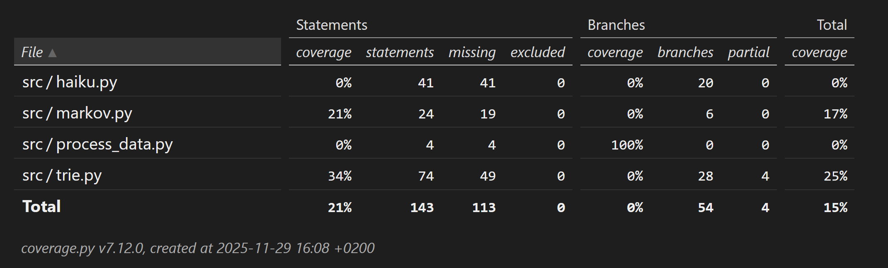

# TESTAUSRAPORTTI

* Yksikkötestauksen kattavuusraportti.
* Mitä on testattu, miten tämä tehtiin?

## TRIE:n testaus
* Yksikkötestit:
Yksikkötestissä trie-rakenteelle annetaan sanakirjana 3-grammit.
Testillä def test_trie_insert_markov_chain(self) testataan, onko kolmikot tallentunut trie rakenteeseen ja löytyvätkö ne sieltä.
Testillä def test_search_empty_string(self) testataan tyhjää syötettä.
Testillä def test_search_none(self) tulisi palauttaa tyhjä lista none-pituudella ja none-k-asteella.
Testillä def test_structure(self) tulostetaan trien rakenne solmuineen ja niiden lapsineen tarkasteltavaksi.

## Markovin ketjun testaus
* Päästä päähän testaus
* tarkastetaan onko generoidun haikurunon sanat löydettävissä peräkkäin alkuperäisestä tekstiaineistosta

* Minkälaisilla syötteillä testaus tehtiin?
* Miten testit voidaan toistaa?
* konkreettista tietoa testeistä

Raportti viikolla 5 (ei vielä Markovia testattu tässä):

## Pylint testaukset viikolla 5:
* trie.py: 7.97 siivottuna: 9.17, eniten ylimääräisiä välilyöntejä ja lisätty kommentteja metodien alle
* markov.py: 8.33 siivottuna: 9.17, lisätty kommentteja metodien alle
* haiku.py: 7.07 (keskeneräinen)
